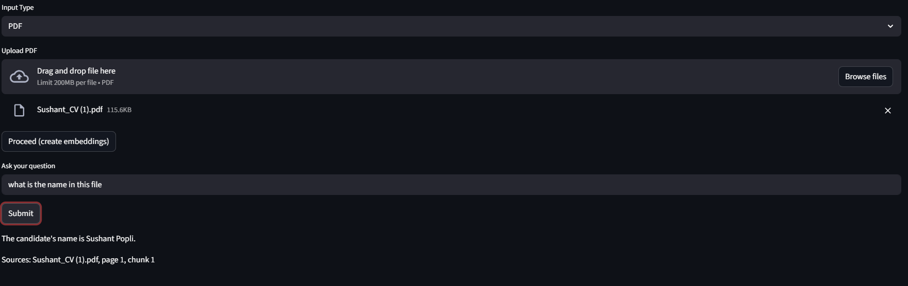
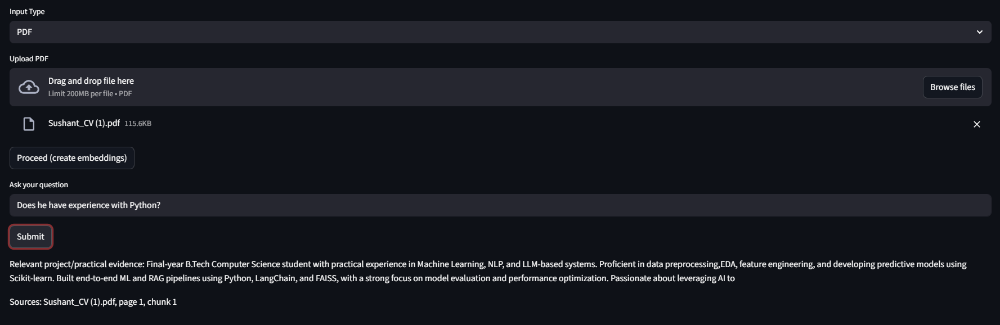
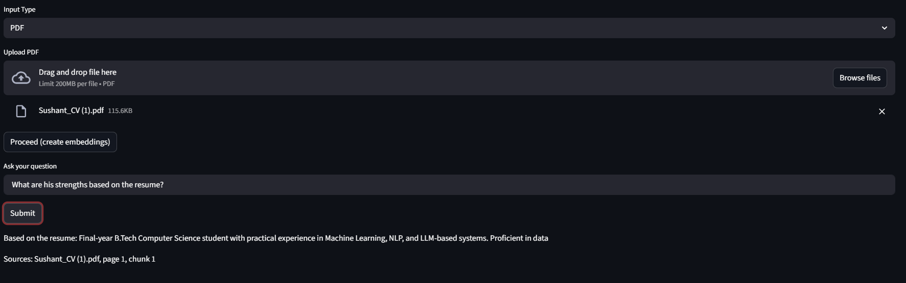
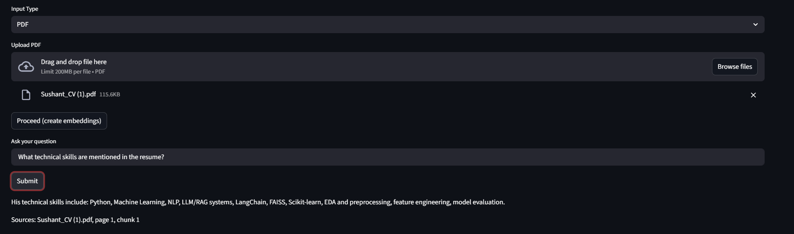
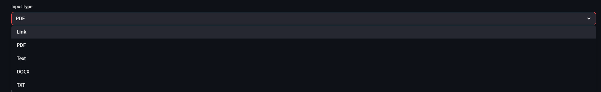

# RAG Q&A Application

A document question-answering application built with Streamlit, LangChain, Hugging Face embeddings, and FAISS. The app lets users upload documents, converts the content into searchable vector embeddings, retrieves the most relevant chunks for a query, and returns grounded answers with source references.

## Project Highlights

- Multi-format document ingestion: PDF, DOCX, TXT, pasted text, and URLs.
- Semantic search using `sentence-transformers/all-mpnet-base-v2`.
- FAISS vector store for fast similarity retrieval.
- Source-aware answers with page/chunk citations.
- Resume-focused answer handling for candidate screening use cases.
- Optional Hugging Face hosted LLM integration.
- Local fallback answer engine so demos continue working even when API access fails.

## Demo Screenshots

### Candidate Name Extraction



### Python Experience Query



### Candidate Strengths Query



### Technical Skills Query



### Supported Input Types



## Tech Stack

| Layer | Tools |
| --- | --- |
| Frontend | Streamlit |
| RAG orchestration | LangChain |
| Embeddings | Hugging Face sentence-transformers |
| Vector database | FAISS |
| Document parsing | PyPDF2, python-docx, WebBaseLoader |
| Configuration | Environment variables / `.env` |

## System Flow

```text
Document / URL
    -> Text extraction
    -> Chunking with overlap
    -> Hugging Face embeddings
    -> FAISS vector index
    -> Similarity retrieval
    -> Answer generation with source citation
```

## Key Features

### Document Ingestion

Users can upload PDFs, DOCX files, TXT files, paste raw text, or provide webpage URLs. The app extracts text and prepares it for retrieval.

### Semantic Retrieval

The extracted text is split into chunks and embedded using `sentence-transformers/all-mpnet-base-v2`. FAISS is used to retrieve the most relevant chunks for each user query.

### Grounded Answers

Answers are generated only from retrieved document context. Each response includes source metadata such as file name, page number, and chunk number.

### Robust Demo Mode

The app can run without a working hosted LLM token. When `USE_HF_LLM=false`, it uses a local fallback answer layer for common resume-analysis questions such as skills, CGPA, project experience, hiring suitability, and leadership evidence.

## Setup

Clone the repository:

```bash
git clone https://github.com/Sushantpopli/RAG_QNA_Application.git
cd RAG_QNA_Application
```

Create and activate a virtual environment:

```bash
python -m venv .venv
.venv\Scripts\activate
```

Install dependencies:

```bash
python -m pip install -r requirements.txt
```

Create a `.env` file:

```bash
HUGGINGFACEHUB_API_TOKEN=your_huggingface_token_here
USE_HF_LLM=false
```

Run the app:

```bash
python -m streamlit run app.py
```

Open:

```text
http://localhost:8501
```

## Example Questions

```text
What is the candidate's name?
```

```text
What technical skills are mentioned in the resume?
```

```text
Does he have experience with RAG or LLM systems?
```

```text
Is he suitable for a Python developer role? Why?
```

```text
What should I verify in the interview before hiring him?
```

## Environment Variables

| Variable | Required | Description |
| --- | --- | --- |
| `HUGGINGFACEHUB_API_TOKEN` | Optional | Token for Hugging Face hosted inference. |
| `USE_HF_LLM` | Optional | Set to `true` to use hosted LLM responses. Default demo mode is `false`. |

## Repository Structure

```text
.
├── app.py
├── requirements.txt
├── .env.example
├── .gitignore
├── README.md
└── docs/
    └── screenshots/
```

## Resume Description

Built a document-based RAG Q&A application using Streamlit, LangChain, Hugging Face embeddings, and FAISS. The system supports PDF, DOCX, TXT, text, and URL inputs, performs semantic retrieval over document chunks, and returns context-grounded answers with source citations and fallback handling for API failures.

## Future Improvements

- Add persistent FAISS index storage.
- Add page-level highlighting for retrieved PDF sections.
- Add support for multiple uploaded files in one session.
- Add evaluation metrics for retrieval quality.
- Add Docker support for easier deployment.
